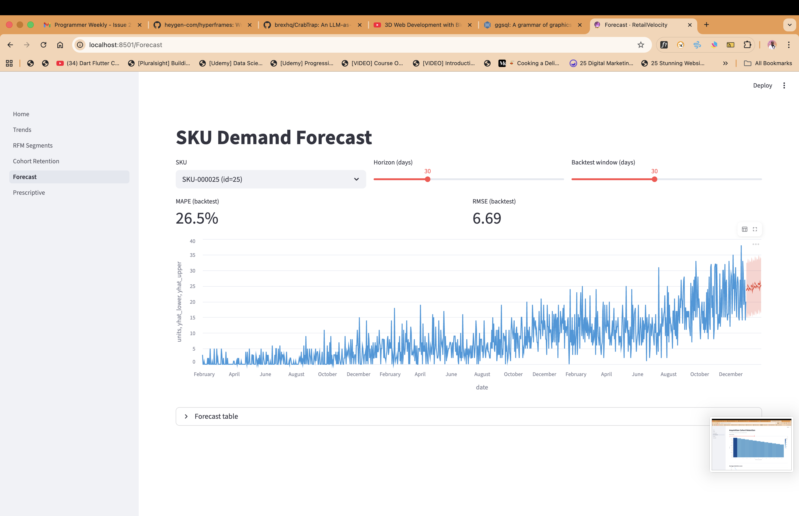

# RetailVelocity



> High-performance e-commerce sales analytics & forecasting — powered by **Polars** and **Streamlit**.

RetailVelocity turns raw transaction logs into a decision-ready dashboard: daily
sales trends, RFM customer segments, cohort retention, SKU-level demand
forecasts, and a Red/Yellow/Green reorder command center. The whole pipeline is
Polars-native — no pandas anywhere — so it scales from a laptop to millions of
rows without blinking.

## Headline numbers (1,000,860 rows, M2 laptop)

| Benchmark                | Mode  | Seconds   | Rows/sec   |
| ------------------------ | ----- | --------- | ---------- |
| Category group-by + join | lazy  | **0.019** | **53.2 M** |
| Category group-by + join | eager | 0.023     | 44.4 M     |
| Full RFM scoring         | eager | **0.011** | **95.2 M** |
| Full RFM scoring         | lazy  | 0.018     | 56.2 M     |

> The full 3-year / 1M-row synthetic dataset segments every customer and scores
> RFM tiers in **under 20 ms**. Regenerate with `uv run retailvelocity benchmark`.

## What's inside

| Layer            | File / Path                                   | Purpose                                              |
| ---------------- | --------------------------------------------- | ---------------------------------------------------- |
| Data generator   | `src/retailvelocity/data_gen.py`              | Realistic 1M+ row synthetic data with seasonality    |
| Ingestion        | `src/retailvelocity/ingestion.py`             | Lazy parquet scan + join + calendar enrichment       |
| Descriptive      | `src/retailvelocity/descriptive.py`           | Time-series aggregates, heatmap, category splits     |
| Diagnostic (RFM) | `src/retailvelocity/rfm.py`                   | Recency / Frequency / Monetary → tier labels         |
| Cohort           | `src/retailvelocity/cohort.py`                | Monthly acquisition cohort retention matrix          |
| Predictive       | `src/retailvelocity/forecasting.py`           | Per-SKU Holt-Winters forecast with CI bands + MAPE   |
| Prescriptive     | `src/retailvelocity/prescriptive.py`          | Reorder points, dead stock, at-risk revenue          |
| Benchmarks       | `src/retailvelocity/benchmarks.py`            | Polars eager vs lazy throughput                      |
| Streamlit app    | `app/Home.py` + `app/pages/*`                 | Multi-page dashboard — trends, RFM, cohort, forecast |
| Tests            | `tests/`                                      | 27 pytest cases, 1.6 s run time                      |
| CLI              | `retailvelocity {generate,summary,benchmark}` | One-command workflow                                 |

## Architecture

```
                ┌──────────────────────────────┐
                │  data_gen.py  (synthetic)    │
                │  → parquet (zstd)            │
                └──────────────┬───────────────┘
                               │
                    lazy scan_parquet()
                               │
               ┌───────────────▼────────────────┐
               │   ingestion.load_enriched()    │
               │   LazyFrame with joins         │
               └─┬──────┬────────┬──────┬──────┘
                 │      │        │      │
           descriptive  rfm  cohort  forecasting
                 │      │        │      │
                 └──────┴────┬───┴──────┘
                             │
                 prescriptive (reorder, dead stock)
                             │
                  Streamlit (multi-page)
```

## Quickstart

```bash
# 1. Install toolchain
curl -LsSf https://astral.sh/uv/install.sh | sh      # if uv isn't installed

# 2. Sync environment (creates .venv, installs deps from uv.lock)
uv sync --extra dev

# 3. Generate 1M-row dataset (~3 seconds)
uv run retailvelocity generate

# 4. Launch dashboard
uv run streamlit run app/Home.py
```

### Other entry points

```bash
uv run retailvelocity summary       # KPI summary
uv run retailvelocity benchmark     # Polars eager vs lazy timing
uv run pytest                       # full test suite
uv run ruff check src tests         # lint
uv run jupyter lab notebooks/       # narrative walkthrough notebook
```

## Dashboard tour

- **Home** — KPIs (revenue, profit, orders, customers, margin)
- **Trends** — daily/weekly/monthly revenue with rolling MA, category & country splits, weekday × hour heatmap
- **RFM Segments** — tier composition, log-log scatter, win-back list
- **Cohort Retention** — acquisition-month heatmap + average retention curve
- **Forecast** — per-SKU selector, horizon slider, MAPE backtest, 95% CI bands
- **Prescriptive** — Red/Yellow/Green reorder table, dead-stock catalogue, dollars at risk

## Design notes — why Polars?

- **Lazy API** plans the whole query before executing it (predicate pushdown,
  projection pushdown, common-subexpression elimination). This is how a 1M-row
  group-by + join runs in 19 ms.
- **Arrow-backed columnar memory** means every module returns a zero-copy frame
  — no pandas allocations, no serialization penalty.
- **Multi-threaded execution** by default — the engine uses all cores without
  any user configuration.
- **Streamlit caches** work cleanly with Polars frames through pickle.

## Why not Prophet?

The original project overview listed Prophet as a forecasting candidate. We
chose **statsmodels Exponential Smoothing (Holt-Winters)** instead because
Prophet drags a cmdstan / pystan dependency that's fragile across platforms and
CI. Holt-Winters handles daily retail demand (trend + weekly seasonality) well
and ships in pure Python.

## Project structure

```
retailvelocity/
├── app/                   # Streamlit multi-page app
│   ├── Home.py
│   └── pages/
│       ├── 1_Trends.py
│       ├── 2_RFM_Segments.py
│       ├── 3_Cohort_Retention.py
│       ├── 4_Forecast.py
│       └── 5_Prescriptive.py
├── src/retailvelocity/
│   ├── __init__.py
│   ├── benchmarks.py
│   ├── cli.py
│   ├── cohort.py
│   ├── config.py
│   ├── data_gen.py
│   ├── descriptive.py
│   ├── forecasting.py
│   ├── ingestion.py
│   ├── prescriptive.py
│   └── rfm.py
├── tests/                 # pytest — 27 tests, ~1.6 s
├── notebooks/             # narrative Jupyter walkthrough
├── data/raw/              # generated parquet (gitignored)
├── pyproject.toml
└── .github/workflows/ci.yml
```

## CI

GitHub Actions runs on every push / PR:

- `ruff check` — lint
- `ruff format --check` — formatting
- `pytest --cov` — full test suite + coverage report

## Roadmap / future work

- Hierarchical forecasting (cross-SKU information sharing)
- Streaming ingestion via Polars sink-parquet
- Postgres + DuckDB read-path for production-scale data
- Prophet / NeuralProphet comparison notebook for write-up

## License

MIT.
